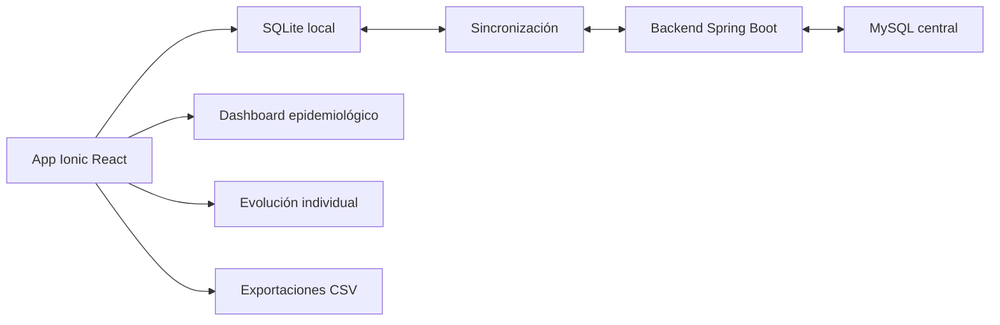

# FRCV

FRCV es una aplicación para el registro, seguimiento y análisis de personas con factores de riesgo cardiovascular. Está pensada para trabajar en territorio, en consultorio y en instancias de análisis epidemiológico, con funcionamiento **offline-first**: la carga diaria se realiza en una base local SQLite y luego se sincroniza con el backend Spring Boot y MySQL.

El sistema permite registrar viviendas, personas, antecedentes, controles domiciliarios, controles de consultorio y resultados de laboratorio. Además incorpora herramientas de lectura clínica y poblacional: dashboard epidemiológico, evolución individual de personas, exportaciones CSV y sábanas de datos.

## ¿Para qué sirve?

- Acompañar el trabajo territorial de agentes sanitarios y enfermería.
- Registrar controles y laboratorios aun sin conectividad.
- Facilitar el seguimiento médico de personas en programa.
- Identificar cohortes accionables: personas con riesgo, sin tratamiento, sin laboratorio o sin control reciente.
- Mejorar la calidad de los datos mediante indicadores auditables.
- Exportar información para análisis clínico, epidemiológico o institucional.

## Usuarios principales

- **Agente sanitario / enfermería:** carga viviendas, personas y controles domiciliarios.
- **Médico/a:** revisa antecedentes, controles, laboratorios, evolución individual y seguimiento terapéutico.
- **Epidemiólogo/a:** usa el dashboard, gráficos, calidad de datos y exportaciones.
- **Administración / equipo técnico:** realiza sincronización, mantenimiento y revisión de consistencia.

## Arquitectura general

## Módulos funcionales

- **Viviendas:** registro territorial con barrio, CAPS, dirección, manzana, casa y georreferencia cuando está disponible.
- **Personas:** datos identificatorios, cobertura, vivienda asociada y estado general.
- **Antecedentes:** HTA, DBT, dislipemia, enfermedad cardiovascular, enfermedad renal, tabaquismo y tratamientos.
- **Controles domiciliarios:** TA, aceptación del programa, aceptación de laboratorio y observaciones.
- **Controles de consultorio:** TA, peso, talla, IMC, medicación, eventos, derivaciones y seguimiento médico.
- **Laboratorios:** resultados por tipo, fecha, valor, unidad y alertas por referencia.
- **Dashboard epidemiológico:** indicadores poblacionales, riesgo clínico, cohortes accionables, calidad de datos y gráficos.
- **Evolución individual:** vista longitudinal para médicos con TA, laboratorios, primer vs último valor y timeline.
- **Exportaciones:** CSV desde indicadores y sábanas personalizadas por vivienda, persona, control, laboratorio o DNI.

## Documentación

La documentación completa está en la carpeta [`docs/`](docs/):

- [Arquitectura offline-first](docs/01-arquitectura-offline-first.md)
- [Operación del agente sanitario](docs/02-operacion-agente-sanitario.md)
- [Operación médica](docs/03-operacion-medica.md)
- [Dashboard epidemiológico](docs/04-dashboard-epidemiologico.md)
- [Exportaciones y sábana epidemiológica](docs/05-exportaciones-y-sabana.md)
- [Sincronización](docs/06-sincronizacion.md)
- [Modelo de datos principal](docs/07-modelo-datos-principal.md)
- [Roles y permisos](docs/08-roles-y-permisos.md)
- [Cambios recientes](docs/09-cambios-recientes.md)
- [Mapa territorial y calidad geográfica](docs/10-mapa-territorial-y-calidad-geografica.md)
- [Línea de calidad del dato](docs/11-linea-calidad-del-dato.md)
- [Tablero de administración online](docs/12-tablero-administracion-online.md)

## Principios de diseño

- Funcionar sin conexión durante la carga territorial.
- No perder datos locales.
- Hacer visibles los indicadores importantes para la toma de decisiones.
- Permitir auditoría: cuando un número aparece en el dashboard, debe poder verse su fórmula y su detalle.
- Separar la mirada poblacional de la mirada clínica individual.
- Evitar dependencias innecesarias y mantener el sistema liviano.
