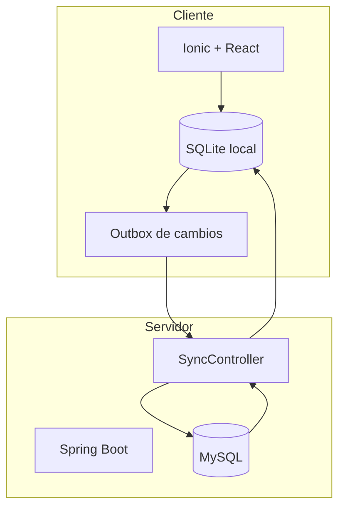

# Arquitectura offline-first

La aplicación está diseñada para funcionar en contextos donde la conectividad puede ser intermitente. Por eso la app móvil/web trabaja primero sobre una base local SQLite y luego sincroniza con el backend.

## Componentes

## Flujo de trabajo

1. La persona usuaria carga datos en el dispositivo.
2. Los datos se guardan en SQLite local.
3. Los cambios pendientes quedan disponibles para exportar/sincronizar.
4. Cuando hay conexión, se envían al backend.
5. El backend consolida en MySQL.
6. La app puede importar datos completos o parciales.

## Reglas importantes

- Las pantallas operativas deben poder trabajar con SQLite local.
- Los conteos del dashboard excluyen registros con `sql_deleted = 1`.
- Las bajas son lógicas para no romper sincronización.
- No se deben agregar entidades nuevas sin revisar SQLite, backend y sincronización.

## Beneficios

- Permite trabajo territorial sin internet.
- Reduce pérdida de datos.
- Facilita campañas en campo.
- Mantiene una base central para análisis y respaldo.
