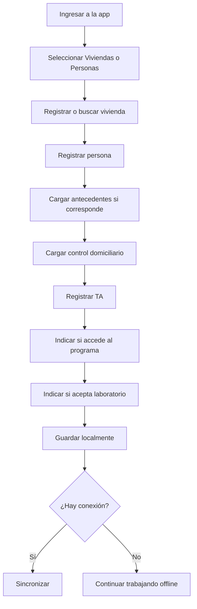

# Operación del agente sanitario

Esta guía describe el uso esperado para agentes sanitarios o personal de enfermería que realiza carga territorial.

## Objetivo operativo

Registrar viviendas, personas y controles domiciliarios durante el trabajo de campo, incluso sin conexión.

## Flujo general

## Datos principales

### Vivienda

- Barrio.
- CAPS.
- Dirección.
- Manzana.
- Casa.
- Fecha.
- Motivo de acceso o no acceso.
- Ubicación si está disponible.

### Persona

- DNI.
- Apellido y nombre.
- Sexo.
- Fecha de nacimiento.
- Teléfono.
- Cobertura de salud.
- Vivienda asociada.

### Control domiciliario

- Fecha de visita.
- TA sistólica.
- TA diastólica.
- Accede al programa.
- Acepta laboratorio.
- Observaciones.

## Recomendaciones de carga

- Cargar DNI siempre que sea posible.
- Completar fecha de nacimiento para permitir análisis por edad.
- Asociar la persona a una vivienda.
- Registrar TA aunque sea normal; no registrar solo los valores alterados.
- Usar observaciones para aclarar situaciones de rechazo, ausencia o dudas.

## Calidad de datos

El dashboard epidemiológico permite detectar:

- Personas sin DNI.
- Personas sin fecha de nacimiento.
- Viviendas sin barrio o CAPS.
- Controles sin TA.
- Laboratorios incompletos.

Estos indicadores ayudan a mejorar el trabajo territorial y evitar planillas incompletas.
