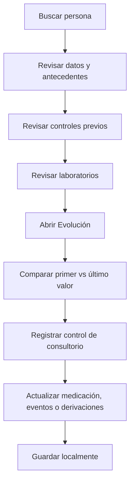

# Operación médica

Esta guía está orientada al médico o médica que atiende en consultorio y necesita revisar el estado clínico de una persona.

## Objetivo clínico

Contar con una vista clara de antecedentes, controles, laboratorios, tratamiento, eventos y evolución individual.

## Flujo médico sugerido

## Vista Evolución

La pestaña **Evolución** está disponible solo para usuarios con rol `MEDICO`.

Muestra:

- Último control.
- Última TA.
- Último laboratorio.
- Estado en programa.
- Aceptación de laboratorio.
- Registro de medicación.
- Comparación entre primer y último valor.
- TA reciente.
- Laboratorios recientes.
- Timeline unificado de visitas y laboratorios.

## Interpretación de la evolución

La vista busca responder preguntas clínicas simples:

- ¿Cuándo fue el último control?
- ¿Cuál fue la última TA?
- ¿Hay alertas actuales?
- ¿La persona está en programa?
- ¿Aceptó laboratorio?
- ¿Hay registro de medicación?
- ¿Mejoró o empeoró respecto del primer valor?

## Control de consultorio

El control de consultorio permite registrar:

- Asistencia.
- TA.
- Peso, talla e IMC.
- Fumador.
- Confirmación de HTA.
- Control o entrega de medicación.
- Motivo de no medicación.
- Eventos clínicos.
- Derivaciones.
- Observaciones.

## Eventos y derivaciones

El sistema permite selección múltiple mediante catálogos sincronizados. Esto evita registrar eventos importantes solo como texto libre y mejora el análisis posterior.
