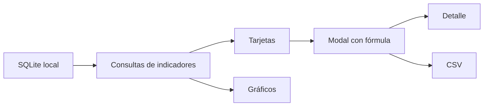

# Dashboard epidemiológico

El dashboard epidemiológico está orientado a médicos y epidemiólogos. Permite ver indicadores poblacionales, riesgo clínico, cohortes accionables y calidad de datos desde SQLite local.

## Acceso

La opción **Dashboard epidemiológico** aparece en la pantalla de selección solo para usuarios con rol `MEDICO`.

## Secciones

### Indicadores generales

- Personas cargadas.
- Viviendas cargadas.
- Personas en programa.
- Controles domiciliarios.
- Controles consultorio.
- Laboratorios cargados.

### Riesgo clínico

- HTA.
- DBT.
- Dislipemia.
- ECV.
- ERC.
- Alertas de TA.
- Alertas de laboratorio.

### Cohortes accionables

- HTA sin tratamiento.
- DBT sin tratamiento.
- Dislipemia sin tratamiento.
- En programa sin laboratorio.
- Acepta laboratorio sin resultado.
- Sin control reciente.

### Calidad de datos

- Personas sin DNI.
- Personas sin fecha de nacimiento.
- Viviendas sin barrio/CAPS.
- Controles sin TA.
- Laboratorios incompletos.

## Auditoría de indicadores

Cada tarjeta puede abrir un modal con:

- Fórmula usada.
- Registros incluidos.
- Exportación CSV del detalle.

Esto permite responder por qué aparece un número determinado. Por ejemplo, “laboratorios incompletos” cuenta laboratorios activos sin `valor_num` y sin `valor_texto`.

## Gráficos

El dashboard incluye visualizaciones simples sin dependencias externas:

- Donas para laboratorios completos vs incompletos.
- Donas de personas visitadas, riesgo detectado y aceptación del programa.
- Barras de cohortes accionables.
- Barras de calidad de datos.
- Barras de volumen de carga.

