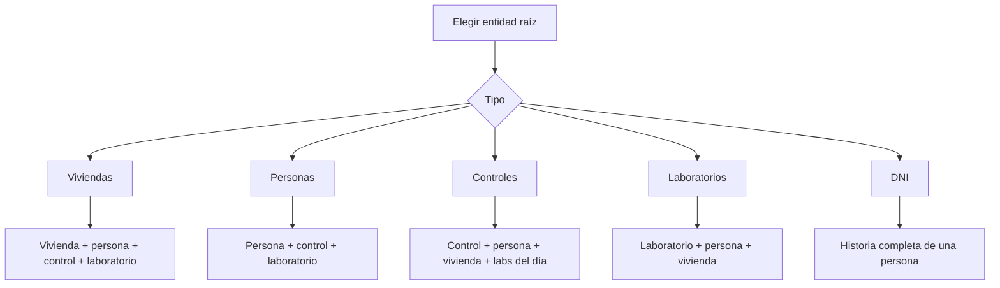

# Exportaciones y sábana epidemiológica

El sistema permite exportar información para análisis en planillas, auditoría clínica o revisión epidemiológica.

## Exportación desde indicadores

Desde los modales del dashboard se puede exportar CSV con:

- Indicador.
- Fórmula.
- ID.
- Título.
- Subtítulo.
- Nota.

Esta exportación sirve para auditar rápidamente un indicador.

## Exportación personalizada

La pantalla **Exportación personalizada** genera una sábana CSV desde SQLite local.

Permite elegir:

- Entidad raíz.
- Rango de fechas.
- Búsqueda por DNI.
- Presets de fecha: hoy, últimos 7 días, últimos 30 días, este mes o todo.

## Entidad raíz

La entidad raíz define qué se repite en la planilla.

## Rango de fechas

El rango de fechas permite limitar la exportación:

- En controles: por fecha de visita.
- En laboratorios: por fecha de realización.
- En viviendas/personas: por fechas relacionadas.
- En DNI: rango opcional sobre historia relacionada.

## Criterio de sábana

Cuando hay relaciones uno-a-muchos, los datos se repiten. Por ejemplo:

- Una vivienda con tres personas genera varias filas.
- Una persona con varios controles genera varias filas.
- Un control con laboratorios del mismo día puede generar una fila por laboratorio.

Esto es esperado en una sábana epidemiológica porque facilita filtrar, pivotear y analizar en Excel u otra herramienta.
