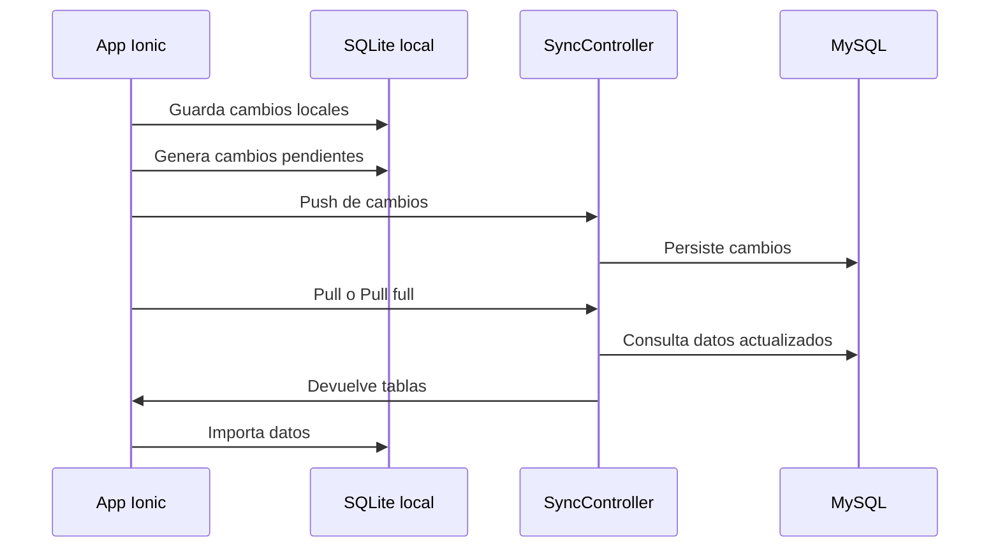

# Sincronización

La sincronización conecta la base local SQLite con el backend Spring Boot y MySQL.

## Flujo simplificado

## Tablas sincronizadas

El sistema sincroniza entidades principales:

- Viviendas.
- Personas.
- Responsables.
- Visitas.
- Controles domiciliarios.
- Controles consultorio.
- Antecedentes.
- Medicación HTA.
- Laboratorios.
- Catálogos.
- Eventos y derivaciones de consultorio.

## Baja lógica

La baja lógica se maneja con `sql_deleted`.

- `sql_deleted = 0`: registro activo.
- `sql_deleted = 1`: registro eliminado lógicamente.

Esto permite sincronizar eliminaciones sin borrar físicamente en todos los dispositivos de forma inmediata.

## Reglas técnicas

- No agregar tablas sin actualizar backend, SQLite y sync.
- Mantener `last_modified` para resolver sincronización.
- Evitar cambios destructivos en esquemas existentes.
- Mantener compatibilidad con trabajo offline.
