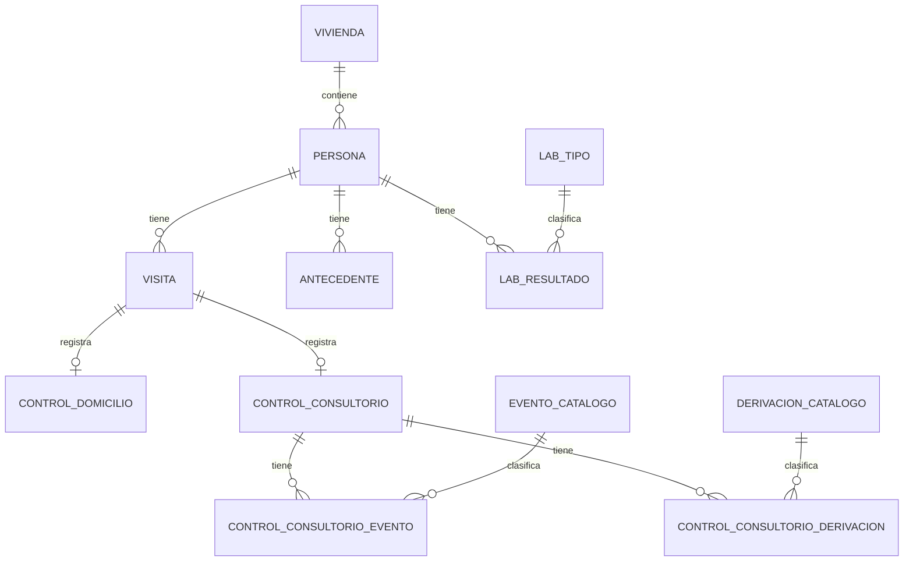

# Modelo de datos principal

Este documento resume las entidades principales del sistema.

## Vivienda

Representa el punto territorial donde vive una o más personas.

Campos relevantes:

- Barrio.
- CAPS.
- Dirección.
- Manzana.
- Casa.
- Fecha.
- Acceso o motivo de no acceso.

## Persona

Representa a una persona registrada en el sistema.

Campos relevantes:

- DNI.
- Apellido.
- Nombre.
- Sexo.
- Fecha de nacimiento.
- Teléfono.
- Cobertura.
- Vivienda asociada.

## Visita

Representa un contacto con la persona.

Tipos:

- Domicilio.
- Consultorio.

## Control domiciliario

Registra datos de campo:

- TA.
- Acceso al programa.
- Aceptación de laboratorio.
- Observaciones.

## Control consultorio

Registra seguimiento médico:

- TA.
- Peso, talla, IMC.
- Medicación.
- Motivo de no medicación.
- Eventos.
- Derivaciones.
- Observaciones.

## Laboratorio

Registra resultados por tipo:

- Colesterol.
- Triglicéridos.
- Glucemia.
- Creatinina.
- Filtrado glomerular.
- Otros tipos configurados.
